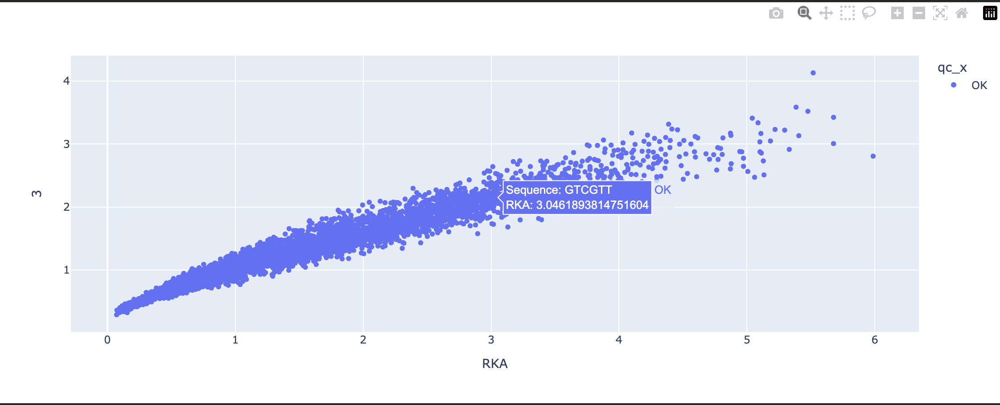

# Implement HiTS-EQ in python - both Equation and curve fitting solutions
Hsuan-Chun Lin 2023.03

This is the python version of my research, HiTS-EQ. Since I have implement it in R in 2015, but there is still inconvenience in that 2015 version. Therefore I have decided to implement HiTS-EQ method, both fitting and equation to python.

There are the improvements from my 2015 R version.

- Multiple binding fractions are support: before in my R version, once we change the number of binding fractions, e.g. from 4 data points to 6 data points, we need to modify the code to adapt the change. Now in this python version by using Pandas, we don't need to do so. Just import your data in the correct format and enjoy the convenience.
- Interactive scatter plot is added to make sure we can quick galance the binding of **each** sequence by **plotly**.

- Multiple filters are added to make sure we can monitor the data and fitting quality.
- Jupyter notebook is provided in order to monitor the process of each step and the source code is more readable.

If this implementation is useful to you, please cite

```
@software{HiTS-EQ_python_HCL 2023,
  author = {Hsuan-Chun Lin},
  month = {03},
  title = {{HiTS-EQ python implementation}},
  url = {},
  version = {1.0.1},
  year = {2023}
}
```
# Requirements

- python version over 3.8
- scipy
- numpy
- pandas
- plotly
- matplotlib
- seaborn


# This project is currently under working.
Please see [HiTS-EQ.ipynb](https://github.com/hsuanchunlin/HiTS-EQ_Python_version/blob/master/HiTS-EQ.ipynb)

For input format, please use
[input_data.csv](https://github.com/hsuanchunlin/HiTS-EQ_Python_version/blob/master/input_data.csv)

In that file, **f** means real binding fraction.

**[E]** means the enzyme or protein concentration you use when you perform the bindning experiment.